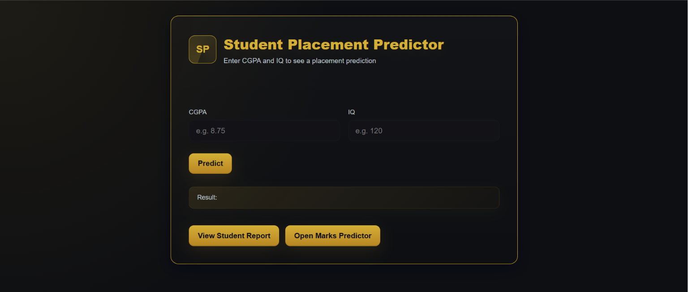
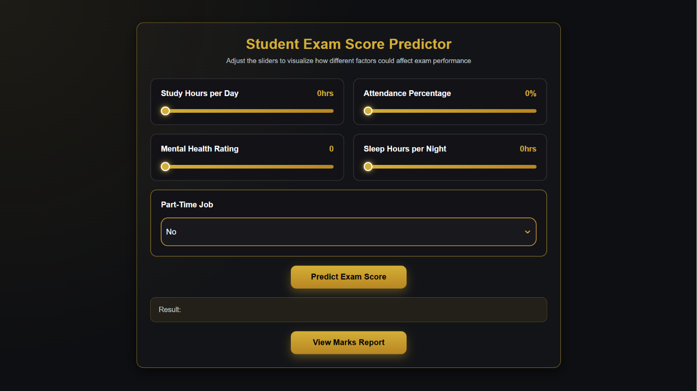

# 🎓 Placement And Marks Predictor


A full-stack Machine Learning web application that predicts two important student outcomes:

* 🎯 **Campus Placement Prediction** based on **CGPA** and **IQ**
* 📈 **Exam Score Prediction** based on **study habits and lifestyle factors**

The project combines **Exploratory Data Analysis (EDA)**, **Machine Learning**, a **Flask REST API**, and a modern **React** frontend to provide an interactive prediction system.

---

# ✨ Features

* 🎯 Placement prediction using Machine Learning
* 📈 Exam score prediction
* ⚡ Fast React + Vite frontend
* 🔗 Flask REST API
* 🤖 Scikit-learn trained models
* 📊 Complete EDA notebooks included
* 📄 HTML prediction reports
* 📱 Clean and responsive user interface

---

# 🛠 Tech Stack

## Frontend

* React 19
* Vite
* React Router
* React Select
* Axios
* Tailwind CSS

## Backend

* Flask
* Flask-CORS
* scikit-learn
* NumPy

## Data Science

* Jupyter Notebook
* pandas
* scikit-learn

---

# 🤖 Machine Learning Models

## Placement Predictor

**Algorithm**

* Logistic Regression

**Input Features**

* CGPA
* IQ

**Output**

* Placed
* Not Placed

---

## Marks Predictor

**Algorithm**

* Linear Regression

**Input Features**

* Study Hours
* Attendance
* Sleep Hours
* Mental Health Rating
* Part-Time Job Status

**Output**

* Predicted Exam Score

---

# 📁 Project Structure

```text
Placement-And-Marks-Prediction/
│
├── backend/
│   ├── app.py                          # Flask API
│   ├── model.pkl                       # Placement prediction model
│   ├── scaler.pkl                      # Feature scaler
│   ├── lr2.pkl                         # Marks prediction model
│
├── EDA/
│   ├── placement_prediction_model.ipynb
│   ├── marks_prediction_model.ipynb
│   ├── placement-dataset.csv
│   └── student_habits_performance.csv
│
├── public/
│   ├── std_report.html
│   └── marks_report.html
│
├── src/
│   ├── components/
│   │   ├── home/
│   │   │   ├── Home.jsx
│   │   │   └── home.css
│   │   │
│   │   └── marks/
│   │       ├── Marks.jsx
│   │       └── marks.css
│   │
│   ├── App.jsx
│   ├── layout.jsx
│   ├── main.jsx
│   ├── App.css
│   └── index.css
│
├── index.html
├── package.json
├── package-lock.json
├── vite.config.js
├── .gitignore
└── README.md
```

---

# 📸 Screenshots


### Placement Predictor


### Marks Predictor


---

# 🚀 Getting Started

## Prerequisites

* Node.js (v18 or above)
* Python 3.x
* pip

(Optional)

* Jupyter Notebook (to explore or retrain the models)

---

## Frontend Setup

```bash
# Install dependencies
npm install

# Start development server
npm run dev
```

Frontend runs on:

```
http://localhost:5173
```

---

## Backend Setup

```bash
cd backend

pip install flask flask-cors scikit-learn numpy

python app.py
```

Backend runs on:

```
http://127.0.0.1:5000
```

> Make sure both the React frontend and Flask backend are running simultaneously.

---

# 📊 Model Training

Both machine learning models were trained using the datasets and notebooks inside the `EDA` folder.

| Notebook                         | Dataset                        | Predicts         |
| -------------------------------- | ------------------------------ | ---------------- |
| placement_prediction_model.ipynb | placement-dataset.csv          | Campus Placement |
| marks_prediction_model.ipynb     | student_habits_performance.csv | Exam Score       |

The notebooks include:

* Data Cleaning
* Exploratory Data Analysis (EDA)
* Feature Engineering
* Model Training
* Model Evaluation
* Model Export

---

# 🔗 API Endpoints

## POST `/predict`

Predicts campus placement.

### Request

```json
{
  "cgpa": 8.75,
  "iq": 120
}
```

### Response

```json
{
  "prediction": "Placed"
}
```

---

## POST `/predict2`

Predicts exam score.

### Request

```json
{
  "study": 6,
  "attendance": 85,
  "mental": 7,
  "sleep": 8,
  "parttime": "no"
}
```

### Response

```json
{
  "prediction": 78.42
}
```

---

# 📜 Available Scripts

| Command           | Description                   |
| ----------------- | ----------------------------- |
| `npm install`     | Install project dependencies  |
| `npm run dev`     | Start Vite development server |
| `npm run build`   | Build production version      |
| `npm run preview` | Preview production build      |
| `npm run lint`    | Run Oxlint                    |

---

# 💡 Future Improvements

* User Authentication
* Prediction History
* Database Integration
* Model Comparison Dashboard
* Cloud Deployment
* Improved Data Visualizations
* Export Predictions as PDF
* User Analytics Dashboard

---

# 👨‍💻 Author

**Aditya Verma**

GitHub: https://github.com/AdityaVerma-18

---

## ⭐ If you found this project useful, consider giving it a star!
